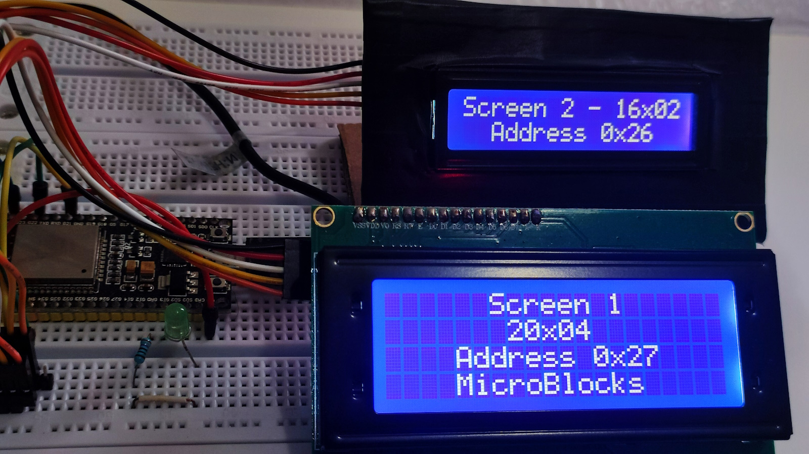
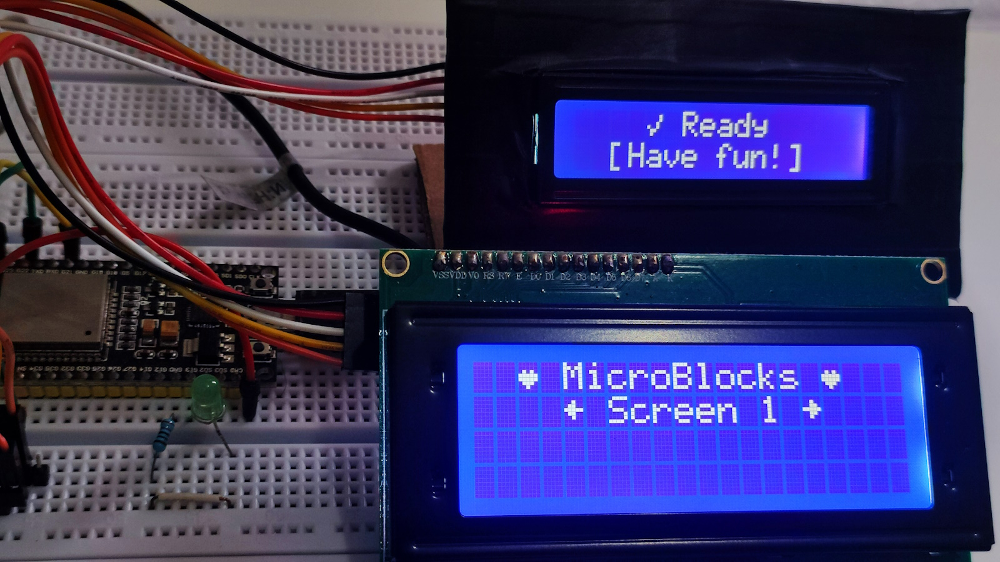
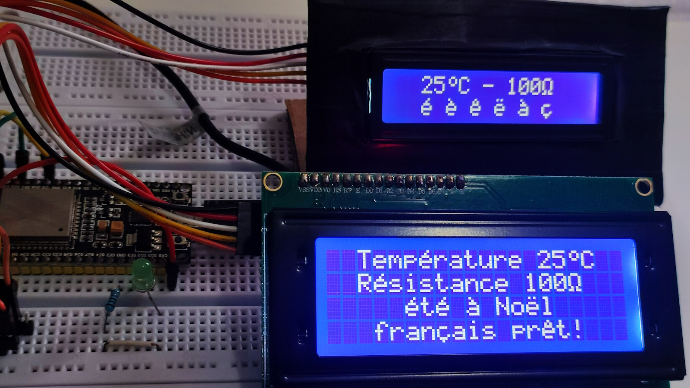
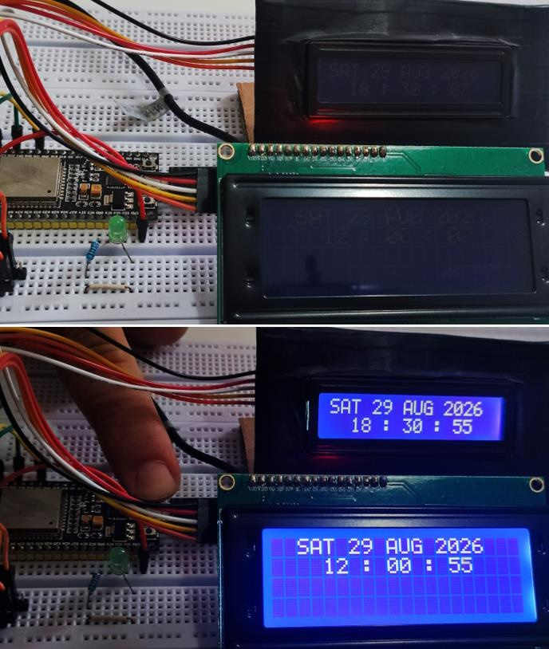
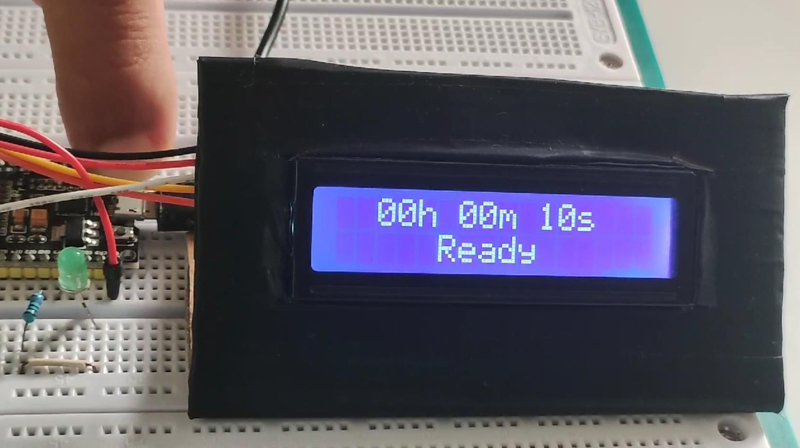

# LCD Multi Display for MicroBlocks

LCD Multi Display is an educational library for MicroBlocks designed to control HD44780 text LCD displays with an I2C interface.

It supports 16x02 and 20x04 displays and can control up to two independent LCDs simultaneously, with automatic I2C detection or fixed addresses.

## Features

- 16x02 and 20x04 LCD displays
- Up to two independent displays
- Automatic I2C detection or fixed addresses
- Print, Center, Scroll, Clear and Backlight
- Symbols and custom 5x8 characters
- Automatic supported accented characters, ° and Ω
- 8 shared CGRAM slots per LCD
- Clock with automatic day-of-week calculation
- Calendar validation and leap-year support from year 2000
- Independent Alarm for each Screen
- Button-controlled Countdown with Ready, Start, Pause, Resume and restart with the same duration
- Configurable GPIO control with optional pull-up
- Persistent and One shot Countdown completion modes

> **Important:** Two LCDs used simultaneously must have different physical I2C addresses.

## Supported Hardware

LCD Multi Display is designed for HD44780-compatible text LCD displays equipped with a supported I2C backpack.

Tested display configurations:

- 16x02 LCD
- 20x04 LCD
- One LCD
- Two LCDs simultaneously with different I2C addresses
- Mixed 20x04 + 16x02 configuration

The examples included with this release were tested using an ESP32 board.

I2C SDA and SCL pins depend on the board being used. LCD I2C addresses may also vary between modules.

The example setup uses:

- Screen 1: 20x04 at `0x27`
- Screen 2: 16x02 at `0x26`

The library can also automatically detect supported LCD I2C addresses using the `Auto` option.

## Installation

1. Download [`LCD_Multi_Display_v1.3.ubl`](https://github.com/ZlitniHsen/LCD-Multi-Display-for-MicroBlocks/releases/download/v1.3/LCD_Multi_Display_v1.3.ubl).
2. Open MicroBlocks.
3. Import the library into your project using the MicroBlocks library import option.
4. The LCD Multi Display blocks will appear in the block palette.
5. Use the `Init` block before any LCD display operation.

After a general MicroBlocks Stop, run `Init` again before using the LCD blocks.

For a first test, select:

- Screen: `1`
- Type: `16x02` or `20x04`
- Address: `Auto`

If two LCDs are used simultaneously, initialize each Screen separately. The two LCD modules must have different physical I2C addresses.

## Quick Start

The simplest LCD Multi Display program requires only two steps:

1. Initialize the display with `Init`.
2. Display text with `Print` or `Center`.

Example configuration:

- Screen: `1`
- Type: `16x02`
- Address: `Auto`

Then use:

`Print "MicroBlocks !" -- Row 1 -- Col 1 -- Screen 1`

or:

`Center "Hello!" -- Row 2 -- Screen 1`

The `Auto` option searches for a supported LCD I2C address during initialization. Once initialized, normal display blocks do not rescan the I2C bus.

> **Important:** `Init` must be run again after a general MicroBlocks Stop.

## Using Two LCDs

LCD Multi Display can control two LCDs independently on the same I2C bus.

Each display is identified by its `Screen` number and keeps its own configuration and state, including display dimensions, I2C address, Backlight, Scroll, CGRAM characters, Clock, Alarm and Countdown.

Example:

- Screen 1: `20x04`, address `0x27`
- Screen 2: `16x02`, address `0x26`

> **Important:** The two LCD modules must have different physical I2C addresses. The library will not assign the same detected or fixed address to both Screens.

You may use a fixed address for each Screen or use `Auto` to detect available supported addresses.

## Public Blocks

LCD Multi Display provides the following public blocks:

**Setup / LCD**

- `Init`
- `LCD connected?`
- `I2C Address`
- `Backlight`

**Text Display**

- `Print`
- `Center`
- `Scroll text`
- `Clear row`

**Clock / Timer**

- `Clock`
- `Alarm`
- `Countdown`
- `Countdown finished?`

**Text Tools**

- `Join`
- `Length of`

**Characters**

- `Symbol`
- `Draw char`
- `Custom char`

Most display operations include a `Screen` parameter to select LCD 1 or LCD 2.

`Symbol` and `Custom char` do not belong to a specific Screen when they are created. They can be combined with text using `Join`, and the target LCD is selected when the resulting character or text is displayed using  `Print`, `Center` or `Scroll text`.

## Custom Characters & CGRAM

Each HD44780 LCD provides 8 custom-character slots in CGRAM.

LCD Multi Display shares these slots between:

- `Symbol`
- `Custom char`
- `Draw char`
- supported accented lowercase characters
- degree (`°`)
- omega (`Ω`)

Identical 5x8 patterns reuse the same CGRAM slot. If all 8 slots are already occupied, a new different custom pattern cannot be added; existing slots are never silently overwritten.

Each Screen has its own independent CGRAM state.

Supported accented lowercase characters are:

`é è ê ë à â ù û î ï ô ç`

Supported uppercase accented characters (`É È Ê À Ù Î Ô Ç`) use an ASCII fallback.

## Clock & Alarm

The `Clock` block provides an independent software clock for each Screen.

It supports:

- Hour: `0–23`
- Minute: `0–59`
- Second: `0–59`
- Year: `2000` or later
- automatic day-of-week calculation
- real calendar validation
- leap years

Invalid dates such as `29 FEB 2026` or `31 APR 2026` are rejected, while valid leap-year dates such as `29 FEB 2028` are accepted.

The `Alarm` reporter independently compares a requested Hr/Min/Sec time with the Clock of the selected Screen and reports true when they match.

This allows two LCDs to run independent Clocks and Alarms simultaneously.

See [`06_a_Two_Clocks_Backlight.ubp`](examples/06_a_Two_Clocks_Backlight.ubp) and [`06_b_Two_Clocks_Alarms.ubp`](examples/06_b_Two_Clocks_Alarms.ubp) for complete examples.

## Countdown

The `Countdown` block provides an independent Hr/Min/Sec timer for each Screen.

A physical GPIO button can control the complete cycle:

`Ready → Start → Running → Pause → Resume → Finished → Ready`

When the Countdown reaches zero, the LCD displays `Time is up!`.

After FINISHED, press the control button once to return to `Ready` with exactly the same duration. Press it again to start a new cycle.

`CtrlPin` selects the GPIO used by the button. GPIO 0 is a valid pin and does not mean “disabled”.

With `Pull-up` ON, the button uses the internal pull-up and is active LOW.

**[Download the complete Countdown cycle](https://github.com/ZlitniHsen/LCD-Multi-Display-for-MicroBlocks/releases/download/v1.3/countdown_cycle1.mp4)**

### Countdown finished?

`Countdown finished?` can operate in two modes:

- `One shot ON`: reports true once when the Countdown finishes. Use it to trigger an event such as a buzzer, relay or timed LED.
- `One shot OFF`: remains true while the Countdown is finished, until it returns to `Ready`. Use it to represent a persistent state.

A new Countdown cycle rearms One shot mode.

Complete examples:

- [`07_Countdown_Control.ubp`](examples/07_Countdown_Control.ubp)
- [`08_a_Countdown_One_Shot_ON.ubp`](examples/08_a_Countdown_One_Shot_ON.ubp)
- [`08_b_Countdown_One_Shot_OFF.ubp`](examples/08_b_Countdown_One_Shot_OFF.ubp)

## Examples

This release includes 10 MicroBlocks project files organized into 8 learning topics:

1. [`01_Hello_LCD.ubp`](https://github.com/ZlitniHsen/LCD-Multi-Display-for-MicroBlocks/releases/download/v1.3/01_Hello_LCD.ubp) — Init, Print, Center and Clear
2. [`02_Two_LCDs.ubp`](https://github.com/ZlitniHsen/LCD-Multi-Display-for-MicroBlocks/releases/download/v1.3/02_Two_LCDs.ubp) — two independent LCDs with different dimensions and I2C addresses
3. [`03_Six_Independent_Scrolls.ubp`](https://github.com/ZlitniHsen/LCD-Multi-Display-for-MicroBlocks/releases/download/v1.3/03_Six_Independent_Scrolls.ubp) — four Scrolls on a 20x04 plus two on a 16x02
4. [`04_Symbols_Custom_Chars.ubp`](https://github.com/ZlitniHsen/LCD-Multi-Display-for-MicroBlocks/releases/download/v1.3/04_Symbols_Custom_Chars.ubp) — Symbol, Join and Custom char
5. [`05_Accents_Special_Chars.ubp`](https://github.com/ZlitniHsen/LCD-Multi-Display-for-MicroBlocks/releases/download/v1.3/05_Accents_Special_Chars.ubp) — accented characters, ° and Ω
6. [`06_a_Two_Clocks_Backlight.ubp`](https://github.com/ZlitniHsen/LCD-Multi-Display-for-MicroBlocks/releases/download/v1.3/06_a_Two_Clocks_Backlight.ubp) — two independent Clocks and Backlight control
7. [`06_b_Two_Clocks_Alarms.ubp`](https://github.com/ZlitniHsen/LCD-Multi-Display-for-MicroBlocks/releases/download/v1.3/06_b_Two_Clocks_Alarms.ubp) — two independent Clocks and Alarms
8. [`07_Countdown_Control.ubp`](https://github.com/ZlitniHsen/LCD-Multi-Display-for-MicroBlocks/releases/download/v1.3/07_Countdown_Control.ubp) — Ready, Start, Pause, Resume and restart
9. [`08_a_Countdown_One_Shot_ON.ubp`](https://github.com/ZlitniHsen/LCD-Multi-Display-for-MicroBlocks/releases/download/v1.3/08_a_Countdown_One_Shot_ON.ubp) — one-time completion event
10. [`08_b_Countdown_One_Shot_OFF.ubp`](https://github.com/ZlitniHsen/LCD-Multi-Display-for-MicroBlocks/releases/download/v1.3/08_b_Countdown_One_Shot_OFF.ubp) — persistent FINISHED state

For illustrated step-by-step explanations, MicroBlocks programs and real hardware results, see:

**[Educational Examples Guide v1.3](docs/LCD%20Multi%20Display%20for%20MicroBlocks.pdf)**

## Video Demonstrations

Real hardware demonstrations are included with this release:

- [`6a_backlight.mp4`](https://github.com/ZlitniHsen/LCD-Multi-Display-for-MicroBlocks/releases/download/v1.3/6a_backlight.mp4) — Backlight control on two LCDs
- [`6b_alarm.mp4`](https://github.com/ZlitniHsen/LCD-Multi-Display-for-MicroBlocks/releases/download/v1.3/6b_alarm.mp4) — Clock and Alarm demonstration
- [`countdown_cycle1.mp4`](https://github.com/ZlitniHsen/LCD-Multi-Display-for-MicroBlocks/releases/download/v1.3/countdown_cycle1.mp4) — complete Ready / Start / Pause / Resume / Finished / Ready cycle
- [`8a_One_shot_On.mp4`](https://github.com/ZlitniHsen/LCD-Multi-Display-for-MicroBlocks/releases/download/v1.3/8a_One_shot_On.mp4) — one-time action when the Countdown finishes
- [`8b_One_Shot_Off.mp4`](https://github.com/ZlitniHsen/LCD-Multi-Display-for-MicroBlocks/releases/download/v1.3/8b_One_Shot_Off.mp4) — persistent FINISHED state

All demonstrations were recorded using real LCD hardware.

## Important Notes & Limitations

- `Init` must be run before using the LCD display blocks.
- After a general MicroBlocks Stop, run `Init` again.
- Two LCDs used simultaneously must have different physical I2C addresses.
- `Auto` detects supported I2C addresses during initialization. Normal display operations do not rescan the I2C bus.
- Each LCD provides 8 CGRAM slots shared by custom characters, symbols and supported special characters.
- When all 8 CGRAM slots are occupied, a new different custom pattern is not registered. Existing patterns are not silently overwritten.
- Supported accented lowercase characters are `é è ê ë à â ù û î ï ô ç`.
- Supported uppercase accented characters (`É È Ê À Ù Î Ô Ç`) use an ASCII fallback.
- Clock accepts years from 2000 onward and uses a software clock; no external RTC is required.
- Countdown must be executed repeatedly, typically inside a `forever` loop, so that timing and button control can be updated.
- With Countdown `Pull-up` ON, the control button is active LOW.
- GPIO availability and I2C SDA/SCL pins depend on the board being used.

## Documentation

The complete illustrated guide is included in this repository:

**[LCD Multi Display — Educational Examples Guide v1.3](docs/LCD%20Multi%20Display%20for%20MicroBlocks.pdf)**

It contains the 10 example projects, MicroBlocks programs, wiring information, usage notes and photographs of real hardware results.

See also the **[CHANGELOG](CHANGELOG.md)** for release information.

## Author

LCD Multi Display for MicroBlocks  
Author: **ZLITNI Hsen**

Developed for the MicroBlocks environment.

## License

This project is released under the MIT License.

See the **[LICENSE](LICENSE)** file for details.
